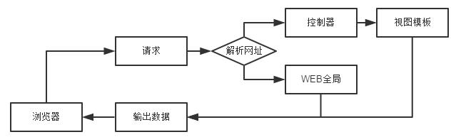

# Kweb - NodeJS

这一是个基于NodeJS编写的小型WEB应用。搭建非常简单。

下图是Kweb运行原理 

# 结构
<pre>
 web // 网站根目录
  ├─controller // 存放控制器目录
  │   └─index.njs // 必须已.njs为扩展名
  └─view // 存放模板目录
      └─controllerName // 对应
         └─controllerPrototypeName.html // 必须要.html为扩展名
-----------------------------------------------------------------
 kweb // 框架
    ├─fs.js // 文件操作，负责控制器、模板、静态页面解析
    ├─http.js // HTTP服务接口
    └─util.js // 自定义工具
</pre>

# 接口
调用框架
<pre>var h = require('./kweb');</pre>

调用后 h 也继承NodeJS原有HTTP模块

> h.globals.webFolder  [string] 设置网站根目录。未设置时将找不到页面。 
> h.globals.main  [string] 设置默认页。如未设置,默认为index。 
> h.html() [none] 启动web服务。 
> .listen(port, [host], [callback])  NodeJS自身接口，请参考Nodejs API。 

# 注意
如果WEB目录下没有控制器文件将直接遍历全站输出对应的静态文件。为了安全，框架禁止外部访问任何controller目录，所以除控制器目录外，不要在其他地方建立名为“controller”的目录。
